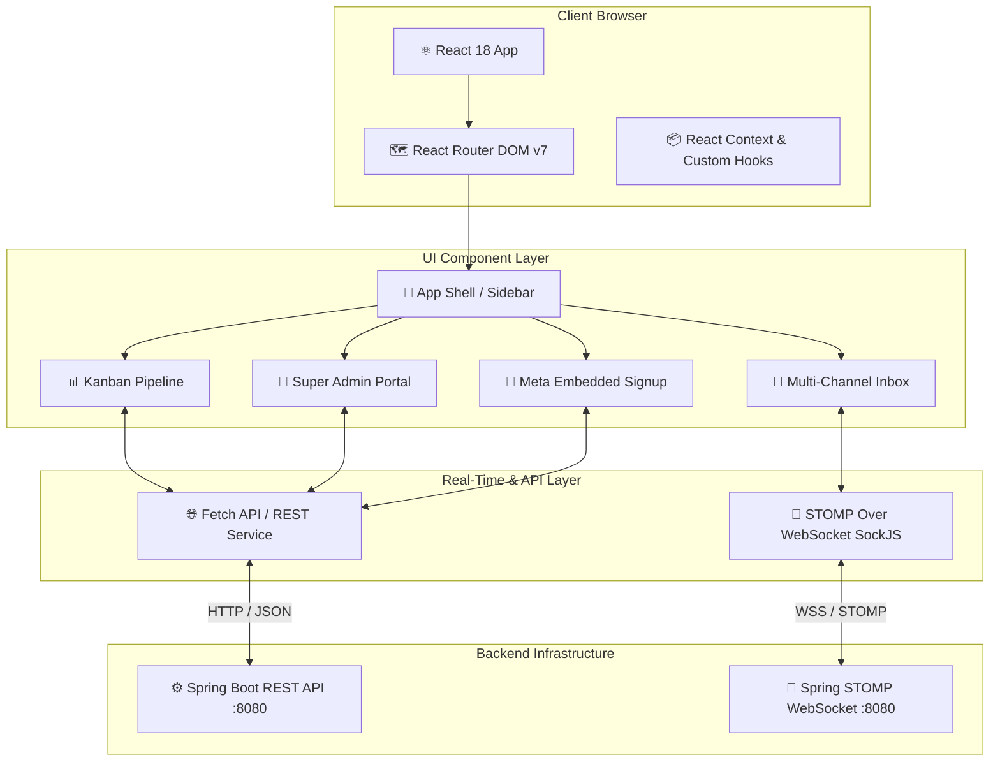

# 🖥️ ChatCRM Lite - Frontend Web Portal

> A modern, ultra-responsive CRM dashboard built with **React 18**, **TypeScript**, **Vite**, **Tailwind CSS**, and real-time **STOMP WebSockets**.


---

## 📋 Table of Contents

- [🌟 About The Application](#-about-the-application)
- [🎯 Features & Modules](#-features--modules)
- [🏗️ Frontend Architecture](#-frontend-architecture)
- [🔧 Tech Stack](#-tech-stack)
- [⚙️ Installation & Setup](#-installation--setup)
- [📁 Project Structure](#-project-structure)
- [🚀 Key User Flows](#-key-user-flows)

---

## 🌟 About The Application

**CRMLite Frontend** (`crmpannel`) is an enterprise-grade Web Dashboard designed for business owners, sales agents, support teams, and platform super-admins. It offers a unified control center to manage multi-channel customer communications (WhatsApp, WebChat, Voice, Email), track leads through interactive Kanban pipelines, automate campaigns, configure RAG AI bots, and manage multi-tenant subscriptions.

---

## 🎯 Features & Modules

### 💬 1. Unified Multi-Channel Live Inbox & Quick Action Bar
- **Multi-Channel Chat**: Manage WhatsApp, WebChat Widget, and Voice conversations in a single unified view.
- **STOMP WebSocket Engine**: Instant real-time message streaming, typing indicators, read receipts, and sound alerts.
- **Agent Workstation & Quick Actions**: Quick-action bar directly above the message composer with **`[Send Menu]`** button (with interactive flow menu picker) and **`[Request Payment]`** modal launcher, alongside 1-click **`Human Mode Active` / `Hand Back to AI Bot`** handover toggles.
- **Customer 24-Hour Policy Window**: Real-time evaluation of WhatsApp 24-hour customer session window; alerts agent if a session is active (interactive bill) or expired (official Meta payment template).

### 📊 2. Kanban Sales Pipeline & Lead Detail Workspace
- **Drag-and-Drop Kanban**: Visual lead stages (New, Contacted, Qualified, Proposal, Won, Lost) with real-time deal total calculations.
- **Rich Lead Detail View**: Detailed customer drawer featuring activity timelines, interaction history, lead scoring badges, deal value, custom fields, and task notes.
- **Async Bulk Import**: CSV/Excel lead importer powered by PapaParse with column field mapping, validation preview, and duplicate checking.

### 💳 3. In-Chat WhatsApp Payments & Payment Dashboard (`WhatsAppPaymentsDashboard`)
- **Payment Request Modal**: Fast in-chat payment link generator with customizable amount, currency, order description, line items, and gateway routing (Razorpay, Cashfree, Stripe, PhonePe).
- **Meta 24-Hour Window Fallback**: Automatically switches between freeform interactive payment cards (active window) and structured Meta-approved payment templates (expired window).
- **Curated Meta Payment Templates**: Clean visual catalog of compliance-ready billing templates (`order_payment_request`, `payment_reminder_urgent`, `payment_link_cta`) with **1-Click Deploy to Meta WABA**.
- **Transactions & Analytics**: Live revenue charts, transaction tables with payment method badges, receipt links, and real-time payment status pills (`PAID`, `PENDING`, `EXPIRED`, `FAILED`).

### 📲 4. WhatsApp Embedded Signup & Coexistence (`MetaConfigView`)
- **One-Click Meta OAuth Popup**: Connect existing WhatsApp Business App numbers directly to Meta Cloud API without losing mobile app chat history or deleting the app.
- **Integration Diagnostics**: Live indicators for WABA ID, Phone Number ID, verified display name, quality rating, and Webhook subscription status with a 1-click retry button.

### 📣 5. WhatsApp Broadcast & Campaign Studio
- **Broadcast Campaigns**: Create targeted WhatsApp broadcast messages for specific contact tags and segments.
- **Template Management**: Visual template editor with dynamic merge variables (`{{1}}`, `{{2}}`), category selection, and submission tracking.
- **Campaign Cleanup & Bulk Deletion**: 1-Click **`Clear All Campaigns`** and individual campaign deletion with cascading cleanup across recipients and execution history.
- **Campaign Analytics**: Real-time progress bars for sent, delivered, read, and failed messages.

### 📧 6. Multi-Provider Email Suite
- **Visual Email Template Builder**: Rich HTML email template creation with live responsive preview.
- **Provider Setup**: Configure custom SMTP credentials, SendGrid, or Amazon SES APIs.
- **Tracking Analytics**: Monitor email delivery rates, open rates (tracking pixel), and link click-throughs.

### 👑 7. Super Admin Platform Portal (`/admin/*`)
- **Tenant Management**: System-wide tenant provisioning, activation/suspension toggles, and resource usage inspection.
- **Subscription & Quota Control**: Manage FREE, MIN, PRO, and ENTERPRISE plans, enforce feature entitlements, and override tenant limits.
- **Platform Analytics & Audit**: Cross-tenant aggregated metrics (active users, total messages, total revenue) and system-wide audit log trail.

### 🧠 8. FAQ & RAG Knowledge Base Engine
- **Document Vector Ingestion**: Drag-and-drop upload for PDF, DOCX, and TXT training documents.
- **FAQ Knowledge Base Editor**: Structured question-answer management with search indexing.
- **AI RAG Guardrails**: Configure AI bot fallback behavior, confidence thresholds, and system prompts.

### 📞 9. Voice Bot & Call Management
- **Voice Agent Configuration**: Configure voice bot persona, language, speech speed, pitch, and Deepgram STT (`nova-2`) / TTS (`aura-stella-en`) models.
- **Call Event Logs**: Review inbound Exotel call logs, caller details, and voice conversation transcripts.

### 🎫 10. Support Tickets & Dynamic Form Builder
- **Ticket Resolution Desk**: Workspace for customer support tickets with SLA status, priority tags, and customer history.
- **Form Configurator**: Visual builder for public support intake forms with custom input fields.

### 🏷️ 11. Custom Branding & White-Labeling
- **Custom UI Themes**: Tenant-level custom color palette selection, header branding, custom logo URL uploads, and "Powered by" watermark removal for PRO/ENTERPRISE tiers.

---

## 🏗️ Frontend Architecture



---

## 🔧 Tech Stack

| Category | Technology | Description |
|----------|-----------|-------------|
| **Framework** | React 18.3 | Core UI library |
| **Language** | TypeScript 5.5 | Type-safe application logic |
| **Build Tool** | Vite 5.4 | Ultra-fast HMR and bundling |
| **Styling** | Tailwind CSS 3.4 | Utility-first responsive design |
| **Icons** | Lucide React | Modern icon set |
| **WebSockets** | @stomp/stompjs & sockjs-client | Real-time chat streaming |
| **Routing** | React Router DOM 7 | Client-side routing |
| **CSV Parser** | PapaParse | Client-side lead bulk import |
| **Markdown** | React Markdown + remark-gfm | AI response formatting |

---

## ⚙️ Installation & Setup

### 📋 Prerequisites
```bash
✅ Node.js 18.x or higher
✅ npm 9.x or yarn / pnpm
```

### 1️⃣ Clone & Install Dependencies
```bash
git clone https://github.com/hkbharti77/crmpannel.git
cd crmpannel
npm install
```

### 2️⃣ Configure Environment Variables
Create a `.env` file in the root directory:
```env
VITE_API_BASE_URL=http://localhost:8080/api/v1
VITE_WS_URL=http://localhost:8080/ws/chat
VITE_META_APP_ID=1573307991099476
VITE_META_CONFIG_ID=1052344107323702
```

### 3️⃣ Start Development Server
```bash
npm run dev
```

Application will run locally on `http://localhost:5173`.

### 4️⃣ Production Build & Preview
```bash
# Type check and build
npm run build

# Preview production build
npm run preview
```

---

## 📁 Project Structure

```
crmpannel/
├── src/
│   ├── assets/             # Static icons, logos, and images
│   ├── components/         # Feature components grouped by module
│   │   ├── admin/          # 👑 Super Admin Platform Portal
│   │   ├── appointments/   # 📅 Appointments calendar & scheduling
│   │   ├── auth/           # 🔐 Login, Register, Reset Password
│   │   ├── broadcasts/     # 📣 WhatsApp Broadcast Campaigns & Templates
│   │   ├── chatroom/       # 💬 Real-time chat room view
│   │   ├── contacts/       # 👥 Contact list & detail management
│   │   ├── dashboard/      # 📊 Main Analytics Dashboard & KPIs
│   │   ├── emails/         # 📧 Email Studio & Templates
│   │   ├── inbox/          # 📥 Unified Multi-Channel Inbox
│   │   ├── knowledge/      # 🧠 FAQ & Document RAG Knowledge Base
│   │   ├── layout/         # 📐 Sidebar, Header, Notification Drawer
│   │   ├── leaddetail/     # 📋 Lead detail modal, scoring, timeline
│   │   ├── meta/           # 📲 WhatsApp Embedded Signup & Config
│   │   ├── onboarding/     # 🚀 Multi-step onboarding wizard
│   │   ├── payments/       # 💳 In-Chat Payments, Modals & WABA Templates
│   │   ├── pipeline/       # 📊 Kanban Sales Pipeline workspace
│   │   ├── settings/       # ⚙️ Business, AI, Voice, and Branding Settings
│   │   ├── team/           # 👥 Team member roles & permissions
│   │   ├── tickets/        # 🎫 Support ticket desk & form builder
│   │   └── ui/             # 🧱 Reusable UI primitives & dialogs
│   ├── context/            # Global React Contexts (Auth, Theme, WS)
│   ├── hooks/              # Custom React hooks (useWebSocket, useLeads, etc.)
│   ├── lib/                # Utility helpers and API client configurations
│   ├── App.tsx             # Root application router & layout controller
│   ├── main.tsx            # Application entry point
│   └── index.css           # Global Tailwind CSS imports & styles
├── public/                 # Public assets
├── package.json            # Dependencies and scripts
├── tailwind.config.js      # Tailwind theme configuration
├── vite.config.ts          # Vite build configuration
└── README.md               # Application documentation
```

---

## 📄 License

📜 Licensed under the MIT License.
